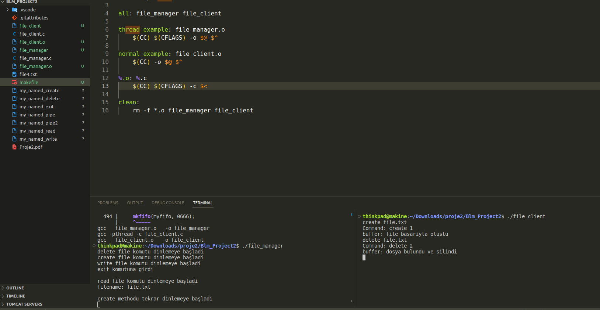

# FİLE MANAGMENT SYSTEM WİTH PİPE_NAMED AND THREADS
- Run make on terminal
* First must be work file_manager.c after than run file_client

## Make Apps

## Run Code And Create file

## Delete file

## Read File 

## Write file

## Exit

